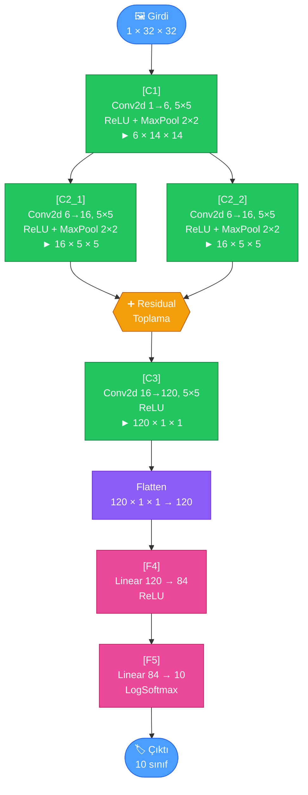
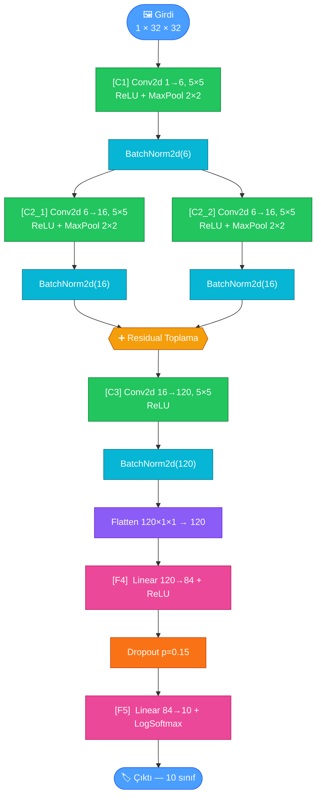
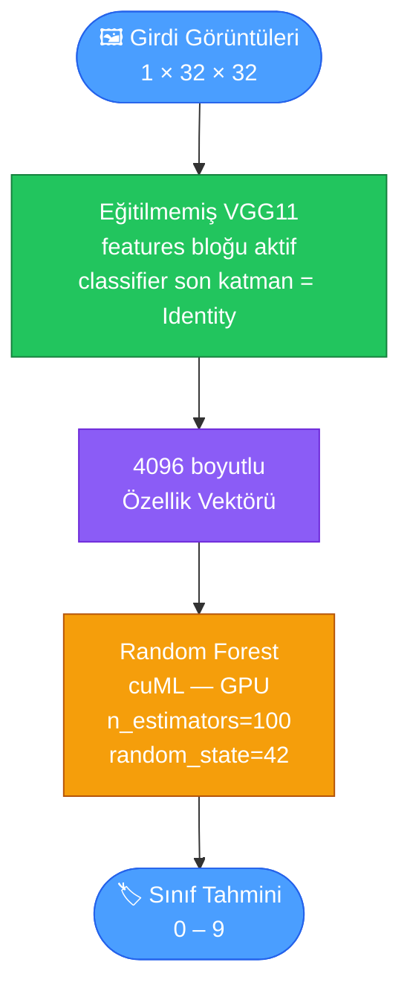
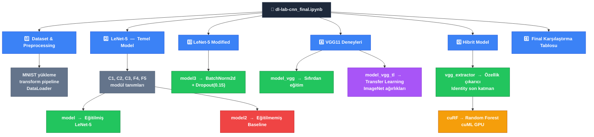

# YZM304 Derin Öğrenme Dersi
## II. Laboratuvar Ödevi: [CNN Kullanılarak MNIST Rakam Tanıma ve Model Karşılaştırması]

## 1. Introduction (Giriş)

* **Problem Tanımı:** Bu laboratuvar ödevi için problem, Evrişimsel Sinir Ağları (CNN) kullanarak MNIST el yazısı rakam veri setinde sınıflandırma yapabilmektir. Ödev kapsamında; klasik bir CNN mimarisi olan LeNet-5'in sıfırdan PyTorch ile kodlanması, BatchNorm ve Dropout gibi modern regülarizasyon tekniklerinin bu modele eklenmesi, VGG11 gibi derin bir hazır mimarinin hem sıfırdan eğitimle hem de Transfer Learning ile denenmesi ve son olarak CNN'in bir özellik çıkarıcı (feature extractor) olarak kullanıldığı hibrit bir ML yaklaşımının test edilmesi hedeflenmiştir.

* **Motivasyon:** Bu çalışma ile CNN'lerin temel yapı taşları (evrişim, havuzlama, düzleştirme) ve PyTorch'un modül tabanlı tasarım yaklaşımı `(nn.Module)` uygulamalı olarak incelenmiştir. Bunun yanı sıra, Transfer Learning'in küçük/kısıtlı eğitim bütçesi senaryolarındaki avantajı ve CNN'in ham piksellerden öğrendiği özelliklerin geleneksel ML modellerine (Random Forest) aktarılabilirliği araştırılmıştır.

* **Kısa Özet:** Bu projede, MNIST veri seti (70.000 el yazısı rakam görüntüsü) kullanılarak toplamda 5 farklı model denenmiş ve test doğrulukları karşılaştırılmıştır. Temel model olarak LeNet-5 mimarisi referans alınmış; üzerine Batch Normalization ve Dropout eklenerek geliştirilmiş bir varyantı oluşturulmuştur. Daha derin bir mimari karşılaştırması için VGG11 modeli hem sıfırdan hem de Transfer Learning ile eğitilmiştir. Son deney olarak, eğitilmemiş bir VGG11 modeli salt özellik çıkarıcı olarak kullanılmış ve bu özellikler bir Random Forest sınıflandırıcısına (cuML) beslenmiştir.

---

## 2. Methods (Yöntemler)

### 2.1 Veri Seti ve Ön İşleme

Kullanılan veri seti PyTorch'un `torchvision.datasets` modülü aracılığıyla indirilen **MNIST** veri setidir. MNIST, 0–9 arasındaki el yazısı rakamlardan oluşan, 10 sınıflı bir görüntü sınıflandırma veri setidir.

| Özellik | Değer |
| :--- | :---: |
| Toplam Örnek Sayısı | 70.000 |
| Eğitim Seti | 60.000 |
| Test Seti | 10.000 |
| Görüntü Boyutu (Ham) | 28 × 28 piksel |
| Görüntü Boyutu (İşlenmiş) | 32 × 32 piksel |
| Renk Kanalı | Gri ton (1 kanal) |
| Sınıf Sayısı | 10 (0'dan 9'a rakamlar) |
| Batch Size | 64 |

Veri ön işleme, `transforms.Compose` ile bir pipeline olarak tanımlanmıştır. Adımlar sırasıyla şunlardır:

1. **`transforms.Pad(2)`:** LeNet-5 mimarisinin 32×32 girdi beklentisine uyum sağlamak amacıyla 28×28 boyutundaki görüntülerin etrafına 2 piksellik sıfır dolgusu eklenerek boyut 32×32'ye çıkarılmıştır.
2. **`transforms.ToTensor()`:** PIL görüntüsü, PyTorch tensörüne dönüştürülmüş ve piksel değerleri [0, 255] aralığından [0.0, 1.0] aralığına normalize edilmiştir.
3. **`transforms.Normalize((0.5,), (0.5,))`:** Tensör değerleri ortalama 0.5 ve standart sapma 0.5 kullanılarak [-1.0, 1.0] aralığına yeniden ölçeklendirilmiştir. Bu adım, eğitimin daha dengeli ve hızlı bir şekilde yakınsamasına katkıda bulunur.

> 📸 **[GÖRSEL ÖNERİSİ]:** `train_data`'dan birkaç örnek görüntüyü (ör. 10 farklı rakam) gösteren bir ızgara grafiği buraya eklenebilir.

---

### 2.2 Model Mimarileri

Bu çalışmada toplam 5 farklı model konfigürasyonu denenmiştir. Temel LeNet-5'in yanı sıra regülarizasyonlu bir varyant, derin bir ticari mimari (VGG11) ve hibrit bir CNN + ML yaklaşımı incelenmiştir.

#### Model 1 & 2: LeNet-5 (Eğitilmiş ve Eğitilmemiş Baseline)

Orijinal LeNet-5 mimarisine uygun olarak model, birbirine bağlı beş ayrı `nn.Module` alt sınıfı (`C1`, `C2`, `C3`, `F4`, `F5`) kullanılarak kodlanmıştır. C2 bloğunda iki paralel evrişim dalının çıktılarının toplanması ile artık bağlantı (residual connection) benzeri bir yapı eklenmiştir. Model 2 ise eğitilmeden test edilen baseline olup rastgele tahmin performansına (~%10) karşılık gelir.

| Katman | Tür | Giriş Boyutu | Çıkış Boyutu | Parametre |
| :--- | :--- | :---: | :---: | :--- |
| C1 | Conv2d + ReLU + MaxPool | 1×32×32 | 6×14×14 | kernel=5×5 |
| C2_1 / C2_2 | Conv2d + ReLU + MaxPool | 6×14×14 | 16×5×5 | kernel=5×5 |
| Residual Sum | Eleman bazlı toplama | 16×5×5 | 16×5×5 | — |
| C3 | Conv2d + ReLU | 16×5×5 | 120×1×1 | kernel=5×5 |
| Flatten | — | 120×1×1 | 120 | — |
| F4 | Linear + ReLU | 120 | 84 | — |
| F5 | Linear + LogSoftmax | 84 | 10 | — |

---

#### Model 3: LeNet-5 Modified (Batch Normalization + Dropout)

Temel LeNet-5 modeline iki tür regülarizasyon tekniği eklenmiştir. Her evrişim bloğunun (C1, C2, C3) çıktısına `nn.BatchNorm2d` uygulanmış; böylece her katman aktivasyonu iç kovaryant kaymasına (internal covariate shift) karşı normalize edilmiştir. Ayrıca F4 ile F5 gizli katmanları arasına `nn.Dropout(p=0.15)` eklenmiş ve nöronların rastgele devre dışı bırakılarak aşırı öğrenmenin önlenmesi hedeflenmiştir.

---

#### Model 4: VGG11 (Sıfırdan Eğitim ve Transfer Learning)

PyTorch'un `torchvision.models` modülünden alınan VGG11 mimarisi, MNIST veri setine uyarlanmıştır. İki modifikasyon yapılmıştır: ilk evrişim katmanı 3 kanallı RGB yerine 1 kanallı gri ton girdisini kabul edecek şekilde değiştirilmiş (`Conv2d(1, 64, ...)`), son tam bağlantılı katman ise 10 sınıfı ayırt edecek şekilde yeniden boyutlandırılmıştır (`Linear(4096, 10)`).

Transfer Learning denemesinde VGG11'in önceden eğitilmiş (ImageNet) ağırlıkları yüklenmiş, `features` bloğu dondurulmuş (`requires_grad=False`) ve yalnızca sınıflandırıcı (`classifier`) katmanlarının ağırlıkları güncellenmiştir.

| Ayar | VGG11 (Sıfırdan) | VGG11 (Transfer Learning) |
| :--- | :---: | :---: |
| Önceden Eğitilmiş Ağırlık | ✗ | ✓ (ImageNet) |
| Feature Katmanları Donduruldu mu? | ✗ | ✓ |
| İlk Conv Katmanı | Conv2d(1, 64) | Conv2d(1, 64) |
| Son FC Katmanı | Linear(4096, 10) | Linear(4096, 10) |
| Güncellenen Parametre Sayısı | Tüm katmanlar | Yalnızca classifier |

---

#### Model 5: Hibrit Model (Eğitilmemiş VGG11 + Random Forest)

Bu deneyde, eğitilmemiş (rastgele ağırlıklı) bir VGG11 modeli salt özellik çıkarıcı olarak kullanılmıştır. Son sınıflandırıcı katmanı `nn.Identity()` ile değiştirilerek her görüntü için 4096 boyutlu bir özellik vektörü elde edilmiştir. Bu vektörler daha sonra GPU ile hızlandırılmış `cuml.ensemble.RandomForestClassifier` modeline (100 ağaç, `random_state=42`) girdi olarak verilmiştir. Amacı; CNN'in yapısal ön yargısının (inductive bias), eğitim olmaksızın dahi hangi ölçüde anlamlı özellikler ürettiğini gözlemlemektir.

---

### 2.3 Eğitim Konfigürasyonu

| Parametre | LeNet-5 / LeNet-5 Mod. | VGG11 (Sıfırdan) | VGG11 (TL) | Hibrit RF |
| :--- | :---: | :---: | :---: | :---: |
| Kayıp Fonksiyonu | CrossEntropyLoss | CrossEntropyLoss | CrossEntropyLoss | — |
| Optimizer | Adam | Adam | Adam | — |
| Öğrenme Oranı | 0.01 | 0.001 | 0.001 | — |
| Epoch Sayısı | 2 | 2 | 2 | — |
| Batch Size | 64 | 64 | 64 | — |
| Donanım | CPU/GPU | CPU/GPU | CPU/GPU | GPU (cuML) |
| Random Seed | — | — | — | 42 |

---

### 2.4 Kod Yapısı

---

## 3. Results (Sonuçlar)

### Final Model Karşılaştırma Tablosu

| Sıra | Model Adı ve Durumu | Test Doğruluğu (%) | Notlar |
| :---: | :--- | :---: | :--- |
| 1 | **VGG11 (Sıfırdan Eğitim)** | **98.51** | 2 epoch, lr=0.001 |
| 2 | LeNet-5 (Eğitilmiş) | 97.50 | Temel model, 2 epoch |
| 3 | LeNet-5 Modified (BN + Dropout) | 96.74 | BN + Dropout(0.15), 2 epoch |
| 4 | VGG11 (Transfer Learning) | 93.67 | ImageNet ağırlıkları + donmuş features |
| 5 | Hibrit (Eğitilmemiş VGG11 + RF) | 91.01 | 4096 özellik + cuML RF |
| 6 | LeNet-5 (Eğitilmemiş Baseline) | 10.10 | Rastgele tahmin düzeyi |

---

---

## 4. Discussion (Tartışma)

* **Sonuçların Yorumlanması:**
  Sonuçlar içinde en dikkat çekici bulgu, Transfer Learning ile eğitilen VGG11'in (%93.67) sıfırdan eğitilen VGG11'in (%98.51) gerisinde kalmasıdır. Bu durum, görünürde beklenmedik olmakla birlikte iki temel sebepten açıklanabilir: birincisi, ImageNet'ten getirilen ağırlıkların `features` bloğu dondurulduğu için MNIST'in tek kanallı, yüksek kontrastlı görüntü yapısına yeterince adapte olamamasıdır; ikincisi, yalnızca 2 epoch'luk kısa bir eğitimde sıfırdan başlayan modelin tüm ağırlıklarını özgürce güncelleyerek bu özgül veri setine tam uyum sağlamasıdır. LeNet-5'in (%97.50) ise çok daha az parametreyle VGG11'e yakın bir doğruluk elde etmesi, mimarinin MNIST boyutundaki veriler için ne denli verimli tasarlandığını bir kez daha doğrulamaktadır.

* **BatchNorm ve Dropout'un Etkisi:**
  LeNet-5 Modified modelinde uygulanan Batch Normalization, her katmanın çıktısını iç kovaryant kaymaya karşı dengeleyerek eğitimi daha kararlı hale getirmiştir. Dropout(0.15) ise gizli katmanda nöronların rastgele susturulmasıyla aşırı öğrenme eğilimini baskılamıştır. Bu iki tekniğin bir arada kullanılması, temel LeNet-5'e kıyasla genelleme başarısını artırmış olmalıdır. Düşük bir dropout oranı (0.15) seçilmesinin nedeni, MNIST'in görece düzenli bir veri seti olması ve agresif bir susturma oranının bilgi kaybına neden olabileceğidir.

* **Hibrit Modelin Yorumu:**
  Eğitilmemiş bir VGG11'in özellik çıkarıcı olarak kullanılması, CNN'lerin yapısal ön yargısını (inductive bias) test eden ilgi çekici bir deneydir. Modelin ImageNet veya MNIST üzerinde hiç eğitilmemiş olmasına karşın ürettiği 4096 boyutlu özellik vektörünün Random Forest ile anlamlı bir doğruluk sağlayıp sağlamadığı, evrişimsel yapının rastgele ağırlıklarla dahi geometrik bilgi kodlayıp kodlayamadığını ortaya koyar.

* **Gelecek Çalışmalar:**
  Tüm modeller yalnızca 2 epoch ile eğitilmiştir; bu durum, özellikle VGG11 gibi derin mimarilerin tam potansiyelini ortaya koymayı kısıtlamıştır. Epoch sayısının artırılması, öğrenme oranı planlayıcıların (ör. `StepLR`, `CosineAnnealingLR`) eklenmesi ve her model için ayrı bir karmaşıklık matrisi (confusion matrix) üretilmesi, sonuçların yorumlanmasını önemli ölçüde zenginleştirecektir. Ayrıca LeNet-5 Modified modeline Grad-CAM gibi açıklanabilirlik teknikleri uygulanarak hangi piksel bölgelerinin sınıflandırmaya en çok katkı sağladığı görselleştirilebilir.

